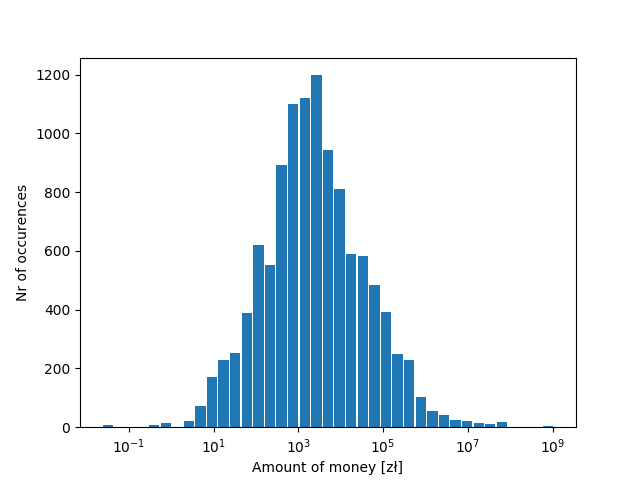
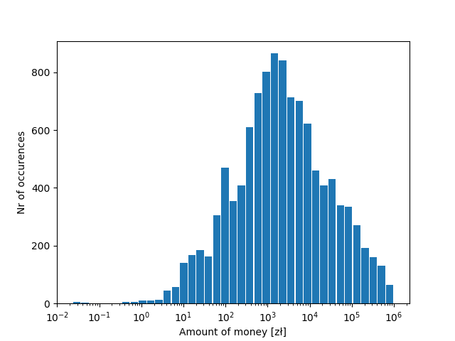
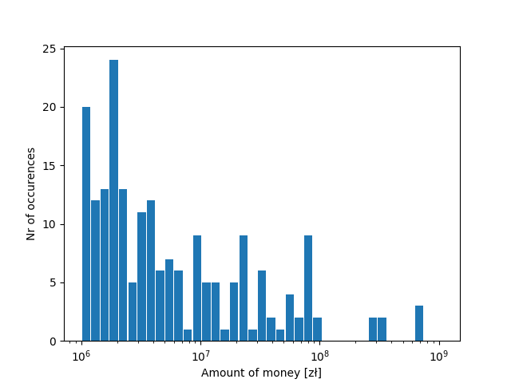

# Regular expressions exercise

## Money amounts in judgements in 2018

### All

### Amounts lesser than 1 000 000 zł

### Amounts bigger than 1 000 000 zł

## References to article 445

art. 445 was mentioned  in 35 verdicts in 2018

## Verdicts with word `szkoda`

nr of verdicts in 2018 where word `szkoda` or its variations is present: 240
