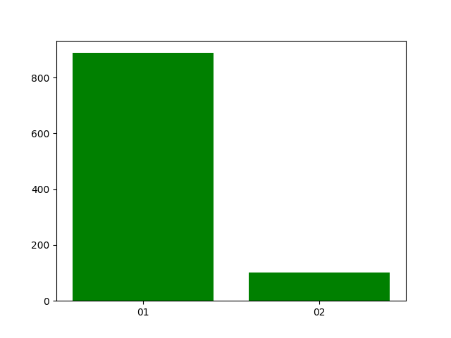

### 6
Judgements with `szkoda` word and variations in 2018: 240

### 7
Judgements with phrase `trwały uszczerbek na zdrowiu` and variations in 2018: 18

### 8
Judgements with phrase `trwały uszczerbek na zdrowiu` and variations possibly intermixed with other words in 2018: 18

### 9
Top 3 judges in 2018: query:
- Barbara Orechwa-Zawadzka : 22
- Alicja Sołowińska : 17
- B. Kempa : 17

### 10
Judgements histogram by months:

